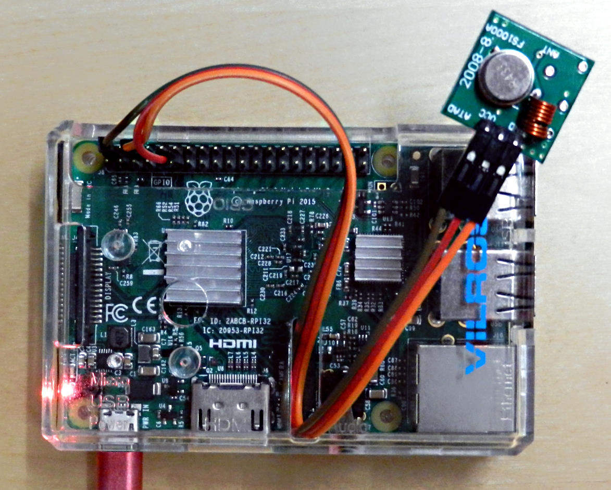

# rspo-send
Raspberry-Pi 433 MHz Remote Switched Power Outlet command sender


## Introduction

This command sender is developed and tested on a Raspberry-Pi 3B.
The rspo-send command is a single cpp file, which can be easily extended by
protocols sniffed with [rspo-sniffer](https://github.com/eesar/rspo-sniffer).
During developed three different brands (ELRO, Conrad and HEITECH)
of ***Remote Switched Power Outlet (RSPO)*** were available, analyzed and tested.


## Bill of Material

* [Raspberry Pi 3B](https://www.amazon.de/UCreate-Raspberry-Pi-Desktop-Starter/dp/B07BNPZVR7)
* [433 MHz Receive and Sending Set](https://www.amazon.de/gp/product/B00OLI93IC)
* [RSPO](https://www.amazon.de/gp/product/B07BHQFZSJ)
* [rspo-send](https://github.com/eesar/rspo-send)


## How To, as Short as Possible

### Connect

1. find the correct pins on your Raspberry-Pi
   - use `gpio readall` on a shell to see all names and purpose of each GPIO
2. connect everything
   - Pin 2 (5v) to VCC of Transmitter (left pin)
   - Pin 6 (0v) to GND of Transmitter (right pin)
   - Pin 11 (GPIO 0) to Data of Transmitter (middle pin)



### Compile and Send

1. get rspo-send
   - clone with git or
   - download and extract zip file
2. check if the protocol you need is defined
   - open `scr/rspo-send`
   - goto line `32` and add your protocol
     (found by [rspo-sniffer](https://github.com/eesar/rspo-sniffer)) if it is missing
3. create the rspo-send executable
   - type `make` to compile the binary
4. test the send function by sending the sniffed code of your remote
   - e.g. `bin/rspo-send ELRO 41511`


### Shell Wrapper Script for Convince

Finally pack all your sniffed codes of your remotes in a bash script and place it as an
executable in a folder which is present in the `PATH` variable for example `~/bin/rspo`.

```bash
#!/bin/bash
# these codes are just examples they will probably not work with your rspo
# use rspo-sniffer to find the codes of your remote

export PATH=/home/pi/rspo-send/bin:$PATH

if [ $1 == stereo ] ; then
    # ELRO A
    if [ $2 == on ] ; then
        rspo-send ELRO 041551
    else
        rspo-send ELRO 041554
    fi
elif [ $1 == subwoofer ] ; then
    # HEITECH A
    if [ $2 == on ] ; then
        rspo-send HEITECH2 EAF17C E0E54C EC02AC EF6B6C
    else
        rspo-send HEITECH2 E2102C E3A4BC E1127C E7532C
    fi
fi
```
Now commands like `rspo stereo on` and `rspo stereo off` should work in the raspberry shell.

For more information about the rspo protocol and some guidance when something is not working
as explained, have a look to my github page and the Remote Switched Power Outlet blog entry.